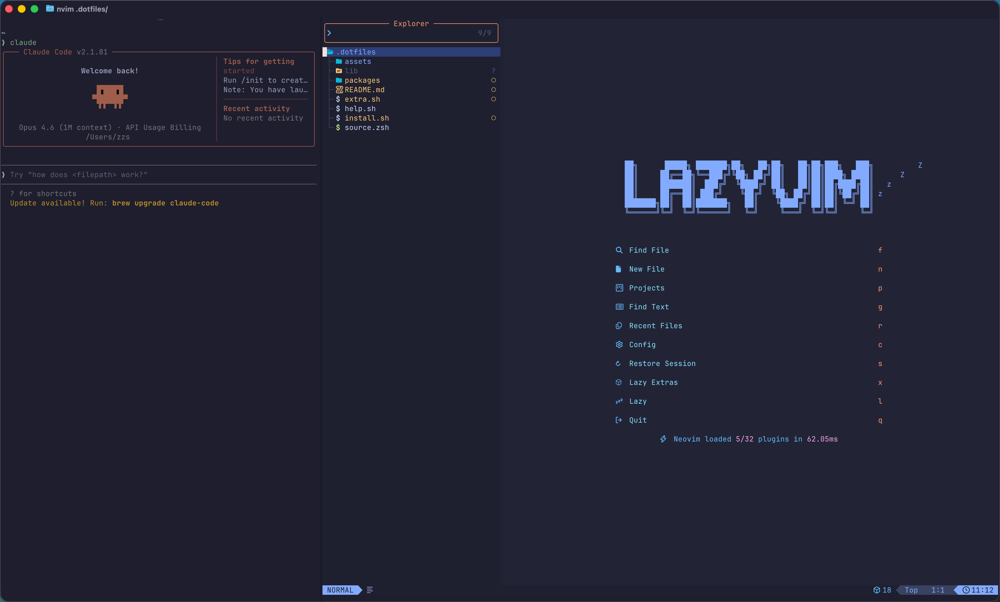

# dotfiles

> 一行命令，把一台空 macOS 装成趁手的开发机。

[](https://www.apple.com/macos/)
[](https://support.apple.com/HT211814)
[](https://zsh.org/)
[](#license)

<p align="center">
  
</p>

## 这是什么

`36node/dotfiles` 是一套面向 macOS 开发者的环境初始化方案。从全新系统到一台
**「装着趁手工具、终端美观、Finder 干净、各种语言版本管理就绪、敏感凭据自动跨机同步」**
的开发机，一条命令搞定，反复执行不出错。

不同于市面常见 dotfiles，本仓库优先选用 **2024–2026 年仍在快速迭代的现代化轻量栈**，
而不是十年来惯性沿用的老组合。

## 适合谁

**适合**：

- 频繁换 Mac、或团队/新人 onboarding 想要一致开发环境
- 国内（或国内出海）开发者 —— 默认就装阿里云 CLI、飞书、微信
- 喜欢「能 fork、能改、能读懂」的人 —— 整个仓库核心 < 200 行 bash

## 核心特点

- **模块化** —— `packages/` 下每个目录是一个独立 package，主脚本自动遍历，互不依赖
- **幂等** —— 所有写入走 `append` / `link_file`，反复跑不会副作用堆叠
- **现代化** —— 见下方"技术栈"，全部 2026 年仍活跃维护的项目
- **可读** —— 主 `install.sh` 不到 160 行，每个 package 自带 README，没有黑魔法
- **跨机同步敏感凭据** —— `.env` 通过 iCloud Drive + 软链方案自动同步，不进 git
- **macOS 系统调优** —— Finder / Dock / 键盘 / 截图路径等开箱即用，每条注释完整

## 技术栈

| 角色 | 选用 | 旧时代做法 |
|---|---|---|
| 终端 | [ghostty](https://ghostty.org/) | iTerm2 / Terminal.app |
| Shell 插件管理 | [antidote](https://getantidote.github.io/) | oh-my-zsh |
| Prompt | [starship](https://starship.rs/) (tokyo-night) | powerlevel10k |
| Node 版本管理 | [fnm](https://github.com/Schniz/fnm) | nvm |
| Node 包管理 | corepack (pnpm / yarn) | 全局 npm install |
| Python | [pyenv](https://github.com/pyenv/pyenv) + 3.14 | system python |
| 编辑器 | [LazyVim](https://www.lazyvim.org/) (neovim) | 自配 .vimrc |
| 字体 | JetBrains Mono Nerd Font | — |
| 容器/编排 | docker + kubernetes-cli + kubectx + helm + k9s | — |
| 国内云 | aliyun-cli | — |
| 通用 CLI | 见下方「命令行工具速查」 | — |

## 命令行工具速查

下面是仓库里**默认装的全部 CLI 工具**，按主题分组。每个工具都附了官方仓库/文档链接，点进去看截图最直观。

### 文件浏览 / 跳转

| 工具 | 功能 |
|---|---|
| [yazi](https://github.com/sxyazi/yazi) | TUI 文件管理器，原生预览图片/视频/PDF（依赖 ffmpeg/imagemagick/poppler/sevenzip） |
| [eza](https://github.com/eza-community/eza) | `ls` 替代：彩色 + git 状态 + tree 模式 |
| [fd](https://github.com/sharkdp/fd) | `find` 替代：更快、默认忽略 `.git` 和 `.gitignore` |
| [zoxide](https://github.com/ajeetdsouza/zoxide) | `cd` 替代：按访问历史智能跳转，输入 `z foo` 直达；`zi` 走 fzf 交互式选 |
| [tree](https://github.com/Old-Man-Programmer/tree) | 经典目录树 |

### 搜索 / 查看

| 工具 | 功能 |
|---|---|
| [ripgrep](https://github.com/BurntSushi/ripgrep) (`rg`) | `grep` 替代，超快 |
| [fzf](https://github.com/junegunn/fzf) | 模糊查找器，被 zoxide / yazi / zsh 历史搜索等多处依赖 |
| [bat](https://github.com/sharkdp/bat) | `cat` 替代：语法高亮 + 行号 + git diff |
| [jless](https://github.com/PaulJuliusMartinez/jless) | TUI JSON viewer，搭配 [jq](https://jqlang.github.io/jq/) 用：jq 处理、jless 浏览 |
| [glow](https://github.com/charmbracelet/glow) | 终端里渲染 markdown，看 README 不用切到 IDE |

### 进程 / 资源监控

| 工具 | 功能 |
|---|---|
| [bottom](https://github.com/ClementTsang/bottom) (`btm`) | `top` / `htop` 替代，跨平台 Rust 实现 |
| [mactop](https://github.com/context-labs/mactop) | macOS 专用，显示 Apple Silicon CPU/GPU 频率 + 能耗 |
| [procs](https://github.com/dalance/procs) | `ps` 替代，彩色更易读 |
| [dust](https://github.com/bootandy/dust) | `du` 替代，树形可视化谁占硬盘 |
| [duf](https://github.com/muesli/duf) | `df` 替代，彩色磁盘容量表 |

### Git / 版本控制

| 工具 | 功能 |
|---|---|
| [git](https://git-scm.com/) | 当然是 git |
| [gh](https://cli.github.com/) | GitHub 官方 CLI（`gh pr`、`gh issue` 等） |
| [lazygit](https://github.com/jesseduffield/lazygit) | Git TUI，键盘流操作 |
| [delta](https://github.com/dandavison/delta) | git diff 美化 pager（**用前需要配置 ~/.gitconfig**，见下文示例） |

### Kubernetes / 容器

| 工具 | 功能 |
|---|---|
| [kubectl](https://kubernetes.io/docs/reference/kubectl/) | k8s 官方 CLI（包名 `kubernetes-cli`） |
| [kubectx / kubens](https://github.com/ahmetb/kubectx) | 快速切换 context / namespace |
| [kubecolor](https://github.com/kubecolor/kubecolor) | 给 kubectl 输出着色 |
| [helm](https://helm.sh/) | k8s 包管理器 |
| [k9s](https://github.com/derailed/k9s) | k8s TUI 管理工具 |
| [k3sup](https://github.com/alexellis/k3sup) | 一键部署 k3s 到任何机器 |
| [docker / docker-compose](https://docs.docker.com/) | docker CLI 和 compose 插件（CLI-only，跟 Docker Desktop 共存时会有 PATH 优先级冲突，详见 `packages/DevOps/install.sh` 注释） |
| [lazydocker](https://github.com/jesseduffield/lazydocker) | Docker TUI，lazygit 同作者 |

### 网络 / 远程

| 工具 | 功能 |
|---|---|
| [autossh](https://www.harding.motd.ca/autossh/) | SSH 隧道断线自动重连，配合 `~/.ssh/config` 的 `LocalForward` 用 |
| [xh](https://github.com/ducaale/xh) | `curl` / `httpie` 替代，语法极简 |
| [wget](https://www.gnu.org/software/wget/) | 经典下载器 |

### 文本 / 数据

| 工具 | 功能 |
|---|---|
| [jq](https://jqlang.github.io/jq/) | JSON 流处理（标杆工具） |
| [sd](https://github.com/chmln/sd) | `sed` 替代，语法直观 |
| [tokei](https://github.com/XAMPPRocky/tokei) | 代码行数统计 |

### 媒体 / 压缩

| 工具 | 功能 |
|---|---|
| [ffmpeg](https://ffmpeg.org/) | 音视频处理，yazi 视频预览也用它 |
| [imagemagick](https://imagemagick.org/) | 图片格式转换，yazi 图片预览也用它 |
| [poppler](https://poppler.freedesktop.org/) | PDF 处理（提供 `pdftotext` / `pdftoppm`），yazi PDF 预览依赖 |
| [sevenzip](https://github.com/p7zip-project/p7zip) (`7zz`) | 7z 压缩格式，yazi 压缩档预览依赖 |

### Shell / 终端

| 工具 | 功能 |
|---|---|
| [tmux](https://github.com/tmux/tmux) | 终端复用 |
| [antidote](https://getantidote.github.io/) | zsh 插件管理器（替代 oh-my-zsh） |
| [starship](https://starship.rs/) | 跨 shell 的 prompt |
| [gum](https://github.com/charmbracelet/gum) | 写交互式 shell 脚本的 UI 组件库 |

### AI CLI

| 工具 | 功能 |
|---|---|
| [claude-code](https://www.anthropic.com/claude-code) | Anthropic 的终端 AI 编码助手（cask 分发，但本质是 CLI） |
| [codex](https://github.com/openai/codex) | OpenAI 的终端 coding agent（cask 分发，本质 CLI） |
| [gemini-cli](https://github.com/google-gemini/gemini-cli) | Google Gemini AI 终端客户端 |

### Cloud / 运维

| 工具 | 功能 |
|---|---|
| [aliyun-cli](https://github.com/aliyun/aliyun-cli) | 阿里云 CLI |
| [ansible](https://www.ansible.com/) | 配置管理与自动化 |

### 编程语言 / 编辑器

| 工具 | 功能 |
|---|---|
| [go](https://go.dev/) | Go 编译器（直接装稳定版，需要多版本切换可改用 `goenv`） |
| [neovim](https://neovim.io/) | 现代 vim，搭配 [LazyVim](https://www.lazyvim.org/) starter 一起装 |
| [ruby](https://www.ruby-lang.org/) | macOS 自带 ruby 太老，brew 装新版（CocoaPods、mas 等工具链需要） |

### 版本管理

| 工具 | 功能 |
|---|---|
| [fnm](https://github.com/Schniz/fnm) | Node 版本管理（nvm 替代，Rust 实现） |
| [pyenv](https://github.com/pyenv/pyenv) | Python 版本管理 |
| [mas](https://github.com/mas-cli/mas) | Mac App Store CLI |

### `delta` 配置示例

`delta` 装上之后默认不会被 git 用到。把以下几条写入 `~/.gitconfig` 立刻生效（你的 `.gitconfig` 跨机器跟着 git 走，配一次到处用）：

```bash
git config --global core.pager 'delta'
git config --global interactive.diffFilter 'delta --color-only'
git config --global delta.navigate true
git config --global delta.line-numbers true
git config --global merge.conflictstyle zdiff3
```

之后 `git diff`、`git show`、`git log -p` 都会自动走 delta。

## GUI 应用速查

仓库默认装的 macOS 桌面应用：

| 工具 | 功能 |
|---|---|
| [ghostty](https://ghostty.org/) | 现代终端模拟器，GPU 加速 |
| [VS Code](https://code.visualstudio.com/) | 编辑器 |
| [GitHub Desktop](https://desktop.github.com/) | GitHub 图形客户端 |
| [Postman](https://www.postman.com/) | API 测试 |
| [Google Chrome](https://www.google.com/chrome/) | 浏览器 |
| [Docker Desktop](https://www.docker.com/products/docker-desktop) | Docker GUI 与 daemon |
| [KeyClu](https://sergii.tatarenkov.name/keyclu/support/) | 长按 Cmd 显示当前 app 的快捷键 |
| [Mos](https://mos.caldis.me/) | 鼠标滚动平滑、反向 |
| [MonitorControl](https://github.com/MonitorControl/MonitorControl) | 用键盘控制外接显示器亮度 / 音量（macOS 自身不支持非 Apple 屏） |
| [飞书 / 微信](https://www.feishu.cn/) | 国内通讯 |

`extra.sh` 里的可选项（询问后才装）：

| 工具 | 功能 |
|---|---|
| [Cursor](https://cursor.com/) | AI 代码编辑器 |
| [cmux](https://github.com/cmux/cmux) | tmux GUI（Sieve Data 出品，小众） |
| [IINA](https://iina.io/) | macOS 原生视频播放器 |
| [Paper](https://paper.fjords.so/) | 自动壁纸 |
| [Dropbox](https://www.dropbox.com/) | 云盘 |
| [ZeroTier](https://www.zerotier.com/) | 虚拟局域网，免开 VPN 跨机直连 |

## 快速开始

```bash
# 1. fork 仓库到自己账号下，再 clone
git clone git@github.com:<你的用户名>/dotfiles.git ~/.dotfiles
cd ~/.dotfiles

# 2. 准备 .env（首次新建可从模板开始；多机用户参见下文 iCloud 同步）
cp .env.example .env

# 3. 一键安装（需要 sudo 密码）
./install.sh
```

`install.sh` 跑完会做：

1. 安装 Xcode Command Line Tools 和 Homebrew
2. 装一组必备 brew / cask 软件（git、gh、ghostty、VS Code、Chrome 等）
3. 遍历 `packages/`，逐个执行各 package 的 `install.sh`
4. 询问是否运行 `extra.sh`（你的个人选装清单）
5. 把根 `source.zsh` 注入 `~/.zshrc`

可重复执行，已装的会跳过。

## 项目结构

```
.
├── install.sh              # 入口：xcode → brew → 必装软件 → packages → extra
├── source.zsh              # shell 启动时自动加载所有 packages/*/source.zsh
├── extra.sh                # 个人选装的 cask 软件（询问后执行）
├── .env / .env.example     # 环境变量（详见 ".env 跨机同步"）
├── lib/                    # 通用辅助函数
│   ├── echo.sh             # 彩色输出 message/success/warn/error
│   ├── append.sh           # 幂等地追加行到文件
│   ├── link.sh             # 软链 + 备份/覆盖/跳过
│   ├── brew.sh             # brew_install / brew_cask_install
│   └── icloud.sh           # iCloud Drive 同步辅助
└── packages/
    ├── terminal/           # ghostty + zsh + antidote + starship + 字体
    ├── node/               # fnm + node + corepack(pnpm/yarn)
    ├── python/             # pyenv + python
    ├── go/                 # go
    ├── nvim/               # neovim + LazyVim starter
    ├── DevOps/             # k8s / docker / 阿里云 / ansible / helm
    └── osx/                # macOS 系统设置（Finder/Dock/键盘 等）
```

每个 package 有可选的：

- `install.sh` —— 主脚本会自动执行
- `source.zsh` —— shell 启动时根 `source.zsh` 自动加载
- `README.md` —— 单 package 的细节说明

## .env 跨机同步

`.env` 含敏感凭据（GitHub Token、阿里云 AK 等），不进 git，但**通过 iCloud Drive + 正向软链
在多台 Mac 间自动同步**。

```
真身：~/Library/Mobile Documents/com~apple~CloudDocs/.dotfiles/.env
                                                          ▲
                                                          │ symlink
仓库：~/.dotfiles/.env  ───────────────────────────────────┘
```

`install.sh` 调用 `icloud_sync_file .env` 自动处理三种状态：

| 场景 | 行为 |
|---|---|
| 仓库有 `.env`、iCloud 还没有 | `mv` 仓库实体到 iCloud，再建软链（首次迁移） |
| 仓库没有、iCloud 有（新机器） | 直接建软链回仓库 |
| 软链已正确 | 跳过（幂等） |
| iCloud 不可用 | warn 后跳过，安装流程不中断 |

### 机器差异化：`.env.local`

`.env` 跨机器一致 —— 但有些值你**只想这台机器用**（比如机器名、本机独有的 dev token）。
这种情况用 `.env.local`，本机覆盖、不进 git、不进 iCloud。

加载顺序：

```
.env          ← 共享（iCloud 同步、所有 Mac 一份）
.env.local    ← 本机覆盖（不同步，每台机器各写各的）
```

`install.sh` 和 `source.zsh` 都会**先加载 `.env`、再加载 `.env.local`**，
后者覆盖前者的同名变量。这跟 dotenv / Next.js / Vite 的协议一致。

典型用法 —— 让每台 Mac 有独特的 hostname：

```sh
# .env 里（共享）
COMPUTER_NAME=zzs-mac          # 默认值

# 这台 Mac 的 .env.local 里
COMPUTER_NAME=zzs-mbp16        # 本机覆盖

# 另一台 Mac 的 .env.local 里
COMPUTER_NAME=zzs-mini
```

`.env.local` 已加入 `.gitignore`，且不被 `icloud_sync_file` 同步，安全。
不写 `.env.local` 的话就走 `.env` 的默认值，行为不变。

## .ssh 跨机同步

`~/.ssh`（含私钥、`config`、`known_hosts` 等）也通过 iCloud Drive + 软链同步。
真身在 `iCloud Drive/.dotfiles/.ssh/`，本地 `~/.ssh` 是指向真身的软链。

```
真身：~/Library/Mobile Documents/com~apple~CloudDocs/.dotfiles/.ssh/
                                                          ▲
                                                          │ symlink
本地：~/.ssh                ─────────────────────────────┘
```

`install.sh` 会调用：

```sh
icloud_sync_home .ssh    # 建立软链（首次会迁移 ~/.ssh 实体到 iCloud）
fix_ssh_permissions      # 强制修复权限：dir 700、私钥 600、公钥 644
```

**为什么需要 `fix_ssh_permissions`** —— iCloud Drive 同步有时会破坏 Unix 权限位，
而 sshd 对 `~/.ssh` 权限非常严格（不是 700/600 直接拒绝使用密钥）。每次安装兜底
重置一次最稳。

### ⚠️ 关掉 iCloud「优化 Mac 存储」（必做）

macOS 默认开启 **iCloud Drive → 优化 Mac 存储**：当磁盘空间紧张或文件长期未访问时，
系统会把本地副本卸载到云端，本地只剩 metadata（APFS 上叫 `dataless` 文件）。
对一般文件没问题，APFS 会在你访问时自动从云端拉回。

**但对 `~/.ssh` 这种关键场景是个雷**：

- `ssh` 进程因为 macOS TCC 沙盒，**没有权限触发 iCloud 拉回**
- 一旦 `~/.ssh/known_hosts` 或私钥被 evict 成 dataless，`git push` / `ssh server` /
  `scp` 都会突然报 `Operation not permitted`，原因极其隐蔽

**两种解决方法，二选一**：

1. **关掉「优化 Mac 存储」（推荐）**
   系统设置 → Apple ID → iCloud → iCloud Drive → 关闭「优化 Mac 存储」。
   代价：所有 iCloud Drive 文件都常驻本地，占点磁盘。但 `.dotfiles` 这点东西可忽略。

2. **针对单个目录设置「始终保留本地副本」**
   打开 Finder → 进入 iCloud Drive → 找到 `.dotfiles/.ssh` 文件夹 → 右键 → 「始终保留本地副本」。
   只管这一个目录，不影响其他 iCloud 文件的优化策略。

`install.sh` 会在每次跑时主动 `cat` 一遍 ssh 文件来 materialize 它们（当下能恢复），
但这只是临时补救，**不能阻止系统下次再 evict**。所以上面的 GUI 设置必须做一次。

### 跨机器使用场景

- 主力 Mac 上有完整 `~/.ssh`，跑 `./install.sh` → 实体迁移到 iCloud，本地变软链
- 新 Mac 登录同 Apple ID、同步完成后跑 `./install.sh` → 本地 `~/.ssh` 直接软链到 iCloud 真身
- 删/加 SSH key：在任意一台 Mac 编辑（实际写入 iCloud），其他 Mac 自动同步

### 安全边界（极重要）

> **私钥放在 iCloud Drive 等于把密钥交给 Apple 服务器。**
> iCloud Drive **不是端到端加密**（除非启用 Advanced Data Protection，但中国大陆账号不可用）。
>
> 这意味着：
>
> - Apple 员工（或被 Apple 服务器入侵者）理论上能读到你的私钥
> - 国内 Apple ID 的数据由「云上贵州」托管，受国内法律约束
> - 任何登录你 Apple ID 的设备都能拿到所有 SSH key
>
> 如果你的 SSH key 用于访问 **生产服务器、公司内网、关键基础设施**，
> **强烈建议改用 [1Password SSH agent](https://developer.1password.com/docs/ssh/) 等专用方案**。
> 个人项目、低风险场景下，本方案可接受。
>
> **机器特定的高敏感凭据** 适合放 `.env.local`，因为它不会被 iCloud 上传。

## fork 之后怎么改

1. **加自己常用的软件** —— 编辑根 `install.sh` 加 `brew_install` / `brew_cask_install`，或者按主题新建 `packages/<your-package>/install.sh`
2. **个人偏好独立放** —— 可选软件放 `extra.sh`，安装末尾会询问是否执行（不影响主流程）
3. **换 prompt 主题** —— 编辑 `packages/terminal/starship/starship.toml`，或者跑 `starship preset --list` 选别的预设
4. **改 antidote 插件清单** —— 编辑 `packages/terminal/zsh_plugins.txt`，新开终端会自动 bundle
5. **改 macOS 系统设置** —— 编辑 `packages/osx/install.sh`（注意：这真的会改你的系统）

如果你的修改对其他人有价值，欢迎 cherry-pick 后向本仓库提 PR。

## 风险提示

- `packages/osx/install.sh` 会修改 macOS 系统偏好（Finder、Dock、键盘、截图路径等）。如果不希望改系统，跳过此 package 或阅读后注释。
- 安装末尾会 `killall` Finder / Dock / SystemUIServer 等让设置生效，期间 UI 会闪一下。
- 想用 `.env` iCloud 同步前，先确保 iCloud Drive 已启用，否则 `.env` 会留在仓库目录里 —— 注意别 `git add .` 把它带进 git 历史。

## 贡献

欢迎 issue / PR。开始之前请先阅读：

- [贡献指南](CONTRIBUTING.md) —— 仓库设计原则、代码风格、PR 流程
- [行为准则](CODE_OF_CONDUCT.md) —— 社区互动规范

特别欢迎的贡献方向：

- 新增 package（保持单一职责、模块化）
- 用更现代的工具替换老的（请在 PR 里写清楚理由）
- macOS 新版本兼容性修复

## License

本项目采用 [MIT License](LICENSE)，可自由 fork、修改、商用、再分发。
